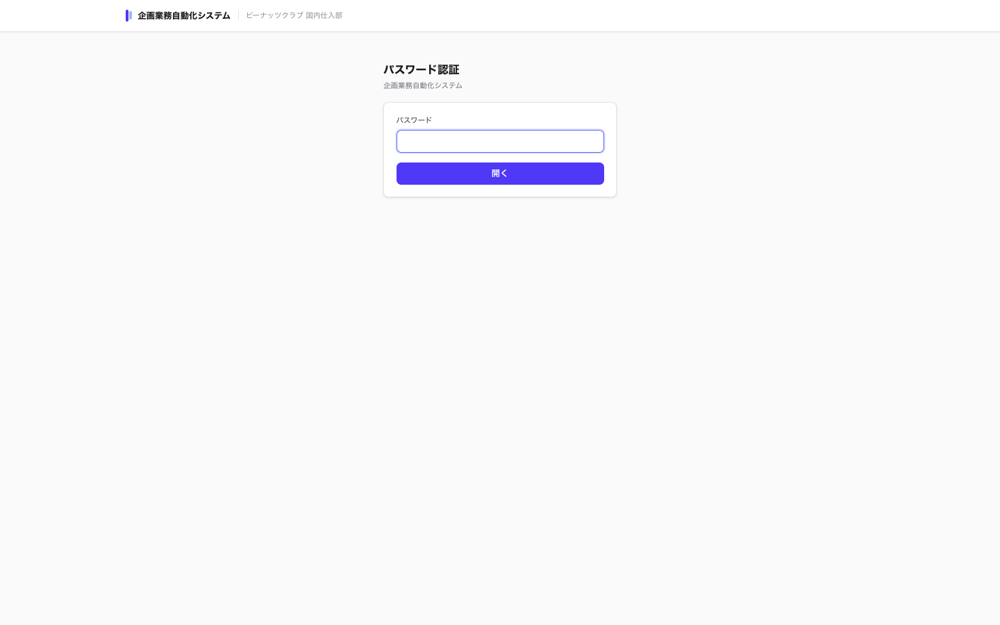
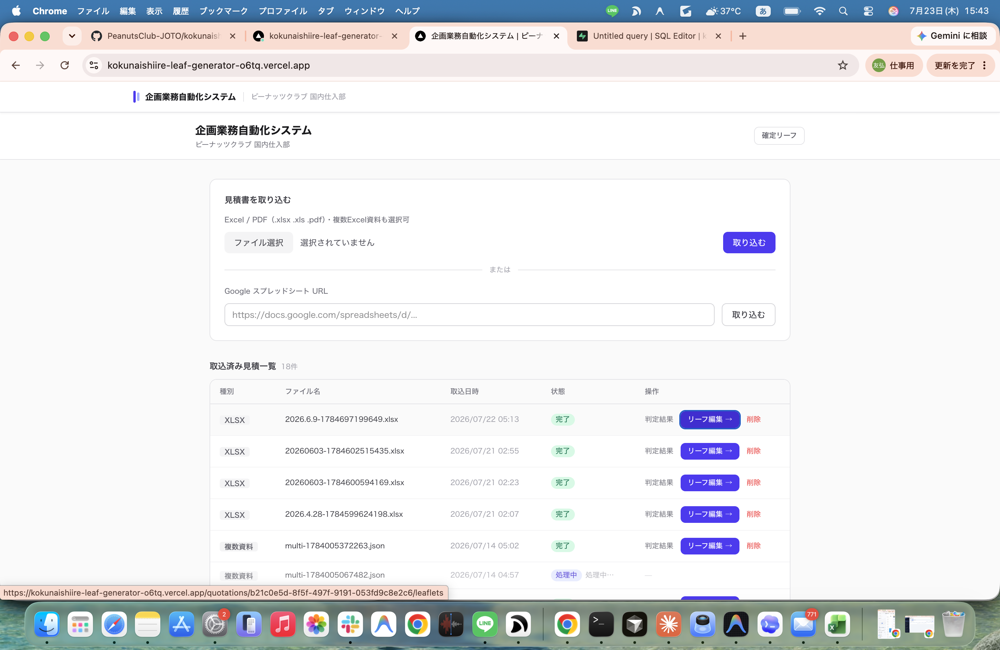
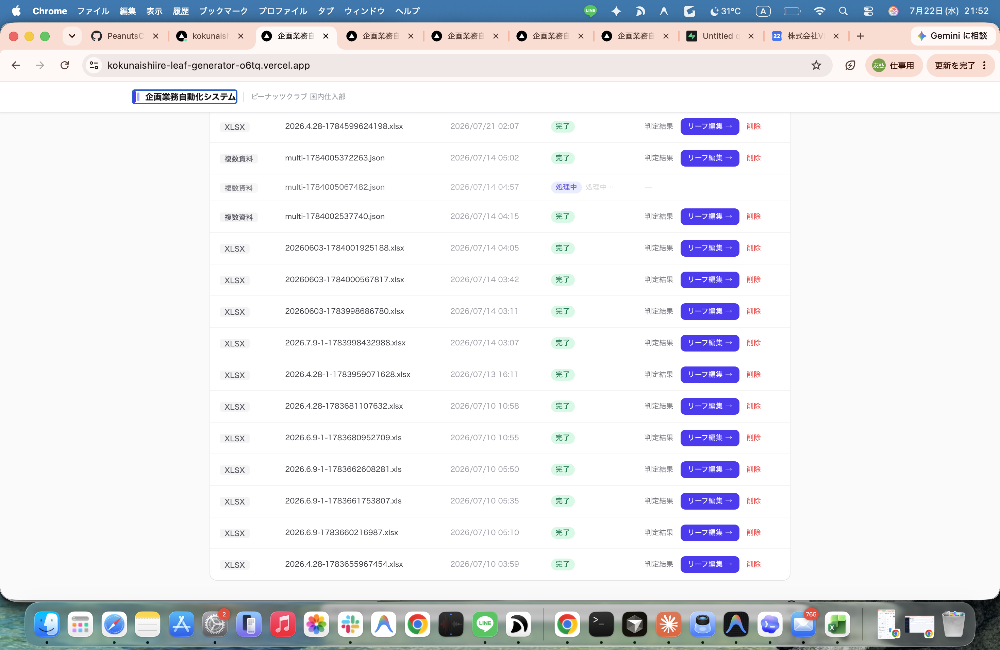
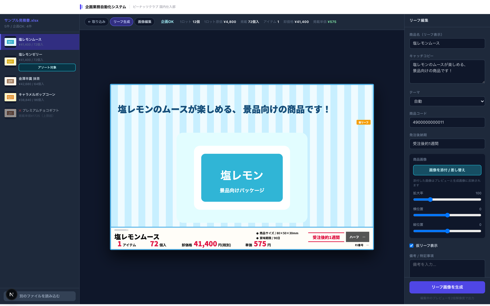

# 企画業務自動化システム 操作マニュアル

作成日: 2026-07-23（更新: 2026-07-24）

## 1. このシステムでできること

このシステムは、メーカーから届いた見積書、商品リスト、発注書などを取り込み、景品向けの企画リーフ作成を支援する社内向けWebアプリです。

主な作業範囲は以下です。

- 見積書、商品リスト、発注書の取り込み
- 商品名、JANコード、入数、単価、上代、賞味期限などの抽出
- 商品画像の抽出と商品情報への紐付け
- 単品リーフ、アソートリーフの作成
- 掲載入数、卸価格、単価、ハーフ可否の自動計算
- キャッチコピー、セールスコピー、商品画像位置の編集
- OCRで読み取った商品情報（品名、JANコード、仕入単価、最小ロット、上代）の手動修正
- AI背景画像の任意生成
- 企画確定後のGoogle Drive転送
- 確定後3日間の確定リーフ確認

今回の納品フェーズでは、メールからの完全自動取り込み、営業担当への自動メール送信、営業向け配信管理は対象外です。

## 2. ログイン

本番URLを開くと、パスワード入力画面が表示されます。



操作:

1. パスワードを入力します。
2. 「ログイン」をクリックします。
3. 正しいパスワードの場合、見積書取り込み画面へ移動します。

補足:

- パスワードは情シス課長の城東さんから共有していただく運用です。
- パスワードを変更する場合は、Vercel本番環境の `APP_ACCESS_PASSWORD` を変更して再デプロイします。
- ログイン状態はブラウザに一定期間保持されます。

## 3. 見積書取り込み画面

ログイン後、最初に表示される画面です。



この画面でできること:

- Excel / PDFファイルの取り込み
- 複数Excel資料の同時取り込み
- GoogleスプレッドシートURLからの取り込み
- 取込済み見積書の一覧確認
- 判定結果画面への移動
- リーフ編集画面への移動
- 確定リーフ一覧への移動
- 不要な見積書の削除

## 4. ファイルを取り込む

対象ファイル:

- `.xlsx`
- `.xls`
- `.pdf`
- GoogleスプレッドシートURL
- 複数Excel資料

操作:

1. 「ファイル選択」をクリックします。
2. 見積書、商品リスト、発注書などのファイルを選択します。
3. 1つの案件に複数資料がある場合は、複数ファイルをまとめて選択します。
4. 「取り込む」をクリックします。
5. 取込ジョブが作成され、処理が開始されます。
6. 処理が完了すると、一覧の状態が「完了」になります。

複数資料取り込みの考え方:

- 商品リストに商品画像とJANコードがある
- 見積書に単価や上代がある
- 発注書に発注単位がある

このように情報が複数ファイルに分散していても、商品名、JANコード、GTINコード、近接テキスト、商品画像情報を使って同じ商品として統合します。

注意:

- 取込中は状態が「処理中」になります。
- 取込が終わるまで「リーフ編集」ボタンは表示されません。
- 取込に失敗した場合は、状態欄にエラーメッセージが表示されます。

## 5. Googleスプレッドシートから取り込む

操作:

1. 「Google スプレッドシート URL」に対象URLを貼り付けます。
2. 右側の「取り込む」をクリックします。
3. システムがスプレッドシートをExcel形式として取得し、商品情報と画像を解析します。

事前条件:

- 対象スプレッドシートがサービスアカウントから読める必要があります。
- Googleサービスアカウントのメールアドレスに、対象スプレッドシートの閲覧権限を付与してください。

## 6. 取込済み見積一覧

一覧には、取り込んだ見積書が新しい順に表示されます。

主な列:

- 種別: XLSX / XLS / PDF / GSheet / 複数資料
- ファイル名: 取り込んだファイル名
- 取込日時: 取り込み日時
- 状態: キュー待機 / 処理中 / 完了 / エラー
- 操作: 判定結果 / リーフ編集 / 削除

## 7. 判定結果

「判定結果」をクリックすると、取り込んだ商品の一覧確認画面へ移動します。

この画面で確認すること:

- 商品名が正しく抽出されているか
- JANコードが正しく入っているか
- 入数、最小ロット、単価、上代が正しく入っているか
- 賞味期限や販売期間が正しく入っているか
- 商品画像が紐付いているか

想定される確認ポイント:

- 単価が0円になっていないか
- 入数が極端に大きくなっていないか
- 商品画像が別商品と逆になっていないか
- 商品名がメーカー名だけになっていないか

ここで気になる箇所が見つかった場合は、削除して再取込するほか、次のリーフ編集画面でも品名・JANコード・仕入単価・最小ロット・上代を直接修正できます（「10. 商品情報の手動編集」を参照）。

## 8. リーフ編集

「リーフ編集」をクリックすると、リーフワークベンチへ移動します。



クリック後の遷移先:

```text
/quotations/[見積ID]/leaflets
```

この画面でできること:

- 左側のリーフ一覧から編集対象リーフを選ぶ
- 中央のプレビューでリーフ画像を確認する
- 右側の編集パネルで掲載情報を修正する
- OCRで読み取った商品情報（品名、JANコード、仕入単価、最小ロット、上代）を修正する
- 掲載入数、卸価格、ハーフ可否を手動で上書きする
- 商品画像の位置や拡大率を調整する
- AI背景を生成、再生成する
- 編集内容を保存してリーフ画像を再生成する
- 企画確定してGoogle Driveへ送る

## 9. リーフワークベンチ

以下は操作説明用のワークベンチ画面です（画面レイアウトの説明用サンプルで、実際の本番画面とは項目の一部が異なります。実際の編集項目は本章の「右側編集パネルで確認、編集できる項目」を参照してください）。



画面構成:

- 左: リーフ一覧
- 中央: リーフ画像プレビュー
- 右: 編集パネル、商品情報の手動編集、計算結果、確定操作

左側のリーフ一覧:

- 単品リーフ、アソートリーフが一覧表示されます。
- クリックしたリーフが中央プレビューと右側編集パネルに表示されます。
- 「確定済み」のラベルが付いたものは、すでに企画確定済みです。

中央プレビュー:

- 現在の編集内容を反映したリーフ画像を確認できます。
- 商品画像の位置調整、キャッチコピー、セールスコピーなどが反映されます。
- AI背景を生成済みの場合は、AI生成背景を使ったプレビューになります。

右側編集パネルで確認、編集できる項目:

- 商品コード
- PJ番号
- 掲載名
- キャッチコピー
- セールスコピー
- 受注後納期
- 商品情報の手動編集（品名、JANコード、仕入単価、最小ロット、上代）
- 商品画像の拡大率、横位置、縦位置
- 金額計算結果（掲載入数、卸価格、ハーフ可否は手動上書き可）
- Drive転送状態

## 10. 商品情報の手動編集

判定結果画面のOCR抽出結果に誤りがある場合、リーフワークベンチの右側編集パネルにある「商品情報（OCR取込値を編集）」欄から、商品ごとに直接修正できます。

編集できる項目:

- 品名（アソートの場合は構成商品ごと。単品の場合は上部の「掲載品名」欄で編集）
- JANコード
- 仕入単価
- 最小ロット数
- 上代

自動計算との連動:

- 仕入単価や最小ロット数を書き換えると、掲載入数・卸価格・単価などの計算結果が自動的に再計算されます。電卓で計算し直す必要はありません。
- 「単価」は「卸価格 ÷ 入数」で常に自動計算される値のため、直接編集することはできません。卸価格または入数を修正すると、単価は自動で追従します。
- 卸価格、入数、ハーフ可否は、計算結果セクションで個別に手動上書きすることもできます（上書き中は項目名の横に「手動」と表示されます）。

反映されるタイミング:

- 入力内容は「情報を保存」をクリックした時点でデータベースに保存され、リーフ画像へ反映されます。

## 11. 商品画像の調整

右側の「商品画像の調整」で、商品画像の見え方を調整できます。

調整項目:

- 拡大率
- 横位置
- 縦位置

操作:

1. 対象リーフを選択します。
2. 「拡大率」「横位置」「縦位置」のスライダーを動かします。
3. 中央プレビューで見え方を確認します。
4. 「情報を保存」をクリックします。
5. 調整内容を反映したリーフ画像が再生成されます。

アソートの場合:

- 商品ごとに画像調整対象を切り替えます。
- 各商品の画像位置を個別に調整できます。

## 12. AI背景生成

ワークベンチでは「背景を生成」または「背景を再生成」をクリックできます。

操作:

1. 対象リーフを選択します。
2. 「背景を生成」をクリックします。
3. Gemini画像生成で背景だけを作成します。
4. 生成後、中央プレビューにAI背景が反映されます。
5. 必要に応じて「背景を再生成」をクリックします。

注意:

- AI背景生成は1回ごとにAPI利用料が発生します。
- 商品画像そのものはAIで作りません。
- 商品画像は見積書や商品リストから抽出した実画像を使います。
- 取り込み画面側の自動生成ON/OFFは隠しています。背景生成はワークベンチで必要なものだけ手動実行する運用です。

## 13. アソート作成

アソート可能な商品がある場合、リーフワークベンチ上に候補が表示されます。

操作:

1. 単品リーフを選択します。
2. 「他の種類もアソートできます」の候補から商品を選びます。
3. 必要に応じてアソート比率を調整します。
4. 「この組み合わせでアソート作成＋画像生成」をクリックします。
5. アソートリーフが作成され、画像生成が始まります。

注意:

- 比率変更後、掲載入数、卸価格、単価が再計算されます。
- 条件外の場合は赤い警告が表示されます。

## 14. 情報を保存

「情報を保存」は、編集した内容をDBへ保存し、リーフ画像を再生成するボタンです。

保存される内容:

- 掲載名
- キャッチコピー
- セールスコピー
- 受注後納期
- 商品コード
- PJ番号
- 商品ごとの品名、JANコード、仕入単価、最小ロット、上代（手動編集した場合）
- 商品画像の調整値
- 手動補正した掲載入数、卸価格、ハーフ可否

保存後:

- リーフ画像生成ジョブが登録されます。
- 生成が完了すると、左側一覧や中央プレビューの画像が更新されます。

## 15. 企画確定してDriveへ送る

最終確認ができたら、「企画確定してDriveへ送る」をクリックします。

処理内容:

1. リーフを確定状態にします。
2. 確定日時を保存します。
3. 確定リーフ一覧に3日間表示される期限を設定します。
4. 生成済みPNGをGoogle Driveの指定フォルダへ転送します。
5. Drive URLと転送ステータスを保存します。

転送先フォルダ:

```text
フォルダ名: リーフ画像確定
フォルダID: 1pGINY-Avt5bjrqNn_BD3BFPILC0E4AEz
```

注意:

- リーフ画像がまだ生成されていない場合は確定できません。
- Drive転送に失敗した場合、画面にエラー理由が表示されます。
- 確定済みリーフは、必要に応じてDriveへ再送できます。
- Google Driveに転送された確定リーフPNGは、システム側の削除や6ヶ月自動削除では消えません。Drive上のアーカイブとして残ります。

## 16. 確定リーフ一覧

画面右上の「確定リーフ」をクリックすると、確定済みリーフの確認画面へ移動します。

この画面でできること:

- 確定済みリーフの確認
- Drive転送状態の確認
- Driveで開く
- 元のリーフ編集画面へ戻る

表示期間:

- 確定後3日間だけ画面上に表示されます。
- 3日後に画面から非表示になります。
- DB上から即時削除されるわけではありません。

## 17. 削除

取込済み見積一覧の「削除」をクリックすると、対象の見積書と関連データを完全削除します。

削除対象:

- 見積書レコード
- シート情報
- 商品情報
- アソート候補
- リーフ情報
- 商品画像
- 生成済みリーフ画像
- PDF
- 元ファイル
- 関連ジョブ

削除対象外:

- Google Driveへ転送済みの確定リーフPNG

注意:

- この操作は取り消せません。
- Drive上の確定リーフPNGを消したい場合は、Google Driveの「リーフ画像確定」フォルダから手動で削除します。
- 誤って削除した場合、同じ見積書を再度取り込む必要があります。

## 18. データ保管期間

取り込んだ見積書は、原則として取り込み日から6ヶ月保管されます。

保管期限:

```text
quotations.expires_at = created_at + 6 months
```

自動削除:

- 毎日1回、期限切れ見積書を削除する処理があります。
- Vercel Cronでは `0 3 * * *` でコード上設定済みです。
- 日本時間では毎日12:00頃に実行されます。

確定リーフ:

- 画面上は確定後3日間表示されます。
- DB上は3日後に即削除されません。
- 元の見積書が6ヶ月期限で削除される時、関連リーフも一緒に削除されます。
- ただし、Google Driveへ転送済みの確定リーフPNGは自動削除されません。Drive上ではアーカイブとして残ります。

## 19. 困ったとき

リーフ編集を押しても開かない:

- 画面を更新してください。
- パスワード画面が出た場合はログインしてください。
- それでも開かない場合は、Vercelのログでリーフ編集ページのエラーを確認します。

画像生成されない:

- `GEMINI_API_KEY` が設定されているか確認します。
- `IMAGE_GEN_MODEL` が利用可能なモデルか確認します。
- APIクレジット残高または課金設定を確認します。

Drive転送に失敗する:

- `GOOGLE_SERVICE_ACCOUNT_EMAIL` が設定されているか確認します。
- `GOOGLE_SERVICE_ACCOUNT_PRIVATE_KEY` が設定されているか確認します。
- `GOOGLE_DRIVE_FINAL_LEAF_FOLDER_ID` が設定されているか確認します。
- 転送先フォルダがサービスアカウントに共有されているか確認します。

商品画像が違う:

- まず、画像の近くに書かれたJANコード・商品名・価格などの文字情報と、見積書内の商品データを照合して紐付けます。
- この方法だけで判断できない画像は、AIが画像そのものを見て、候補商品リストの中から最も近いものを判定します。
- それでも判定を誤る場合は、判定結果画面で気づいた時点で報告いただくか、リーフワークベンチの「10. 商品情報の手動編集」から品名・JANコードを修正し、商品画像自体は差し替えまたは再取り込みで対応します。
- 商品リストと見積書が分かれている場合は、複数資料として同時に取り込むと精度が上がります。
